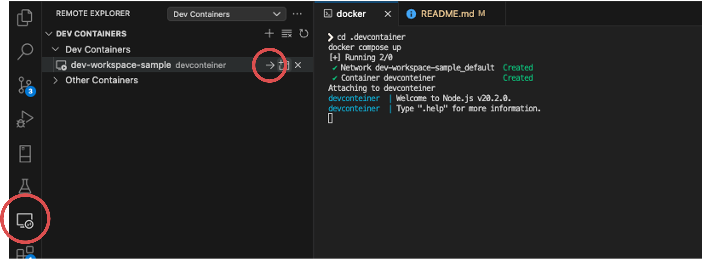

# node-devcontainer-sample

## How to run?

1. Move .devcontainer directory and launch dev container by docker compose.

   ```
   cd .devcontainer
   docker compose up
   ```

2. Get into the dev container
   You may need to install extension for Dev Container.
   
